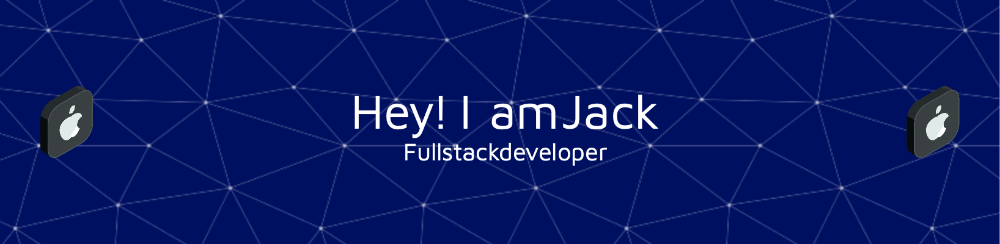

# Hello, World! I'm Jack 👋

I'm a **Full Stack Developer** building enterprise-grade IoT and SaaS platforms. Currently leading **Dust IQ**, a live dust monitoring platform serving major mining operations across Australia.

- 💼 Interested in working together? Reach out via <a href="mailto:hello@fudong.dev">email.</a>
- 💬 Got a question or just curious about something? Feel free to ask!

## 🛠️ Tech Stack

<b>Frontend</b>

 
<code></code>
<code></code>
<code></code>
<code></code>
<code></code>

<b>Backend & APIs</b>

 
<code></code>
<code></code>
<code></code>
<code></code>
<code></code>

<b>Mobile</b>

 
<code></code>
<code></code>

<b>Cloud & DevOps</b>

 
<code></code>
<code></code>
<code></code>
<code></code>

<b>Data & Messaging</b>

 
<code></code>
<code></code>
<code></code>
<code></code>

<b>Languages</b>

 
<code></code>
<code></code>
<code></code>
<code></code>
<code></code>

## 🌟 Featured Projects

### Dust IQ Platform

An end-to-end environmental dust monitoring platform serving major mining operations across Australia. Processes millions of IoT telemetry events daily, delivering real-time dust heatmaps, flow meter analytics, and automated compliance reporting.

- **Dust IQ Web Dashboard** — Operations dashboard for realtime dust monitoring with interactive satellite heatmaps
- 
- **Dust IQ Mobile** — iOS and Android field operator app providing live dust heatmaps, site-level monitoring

### More Projects

- **[CCBuddy](https://github.com/qinscode/ccbuddy)** 🖥️ — Native macOS menu bar app for monitoring Claude Code token usage and costs in real time. Supports Pro/Max and API modes with glass-effect UI, usage charts, and burn rate tracking. Built with SwiftUI, runs 100% locally.

- **[Job Application Tracker](https://github.com/qinscode/jobtracker)** 👨‍💻 — Full-stack job application management platform. Track applications, schedule interviews, and organize follow-ups. Built with .NET 7, React, and Tailwind CSS.

- **[Zephyr](https://github.com/qinscode/Zephyr)** 📝 — A clean note-taking app with colorful folders, smart tags, quick search, and encryption. Simple yet powerful.

- **[Seek Spider](https://github.com/qinscode/SeekSpider)** 🕷️ — Python web crawler for scraping job listings from Seek.com.au. Built with Scrapy and MySQL, with rate limiting handling.

- **[Curriculum Rules Management System](https://github.com/qinscode/UWA-Curriculum-Rules-Management-System)** 🎓 — University course rule management with drag-and-drop interface and auto-generated PDFs. Built with Next.js and NestJS.

## 📈 GitHub Stats

  

    
  

## ⚙️ Development Environment

  <table style="font-size: 11px">
  <tr>
  <td valign="top" width="50%">

#### 🖥️ macOS

Primary development environment — full-stack TypeScript, .NET, and mobile development.

  </td>
  <td valign="top" width="50%">

#### 🐧 Linux & Cloud

Server infrastructure, CI/CD runners, and production deployments on Azure.

  </td>
  </tr>
  </table>

---
